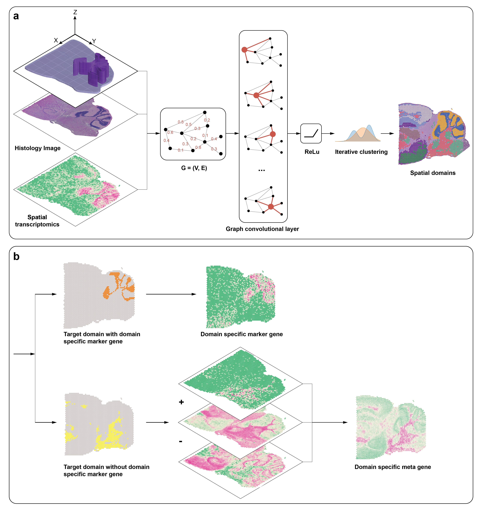

# 目录
- [1 空间转录组数据聚类分析方法](#整理到的对空间转录组进行聚类分析的算法)  
- [2 空间转录组数据集](#目前整理到可以使用的数据集)  
- [3 聚类评价方法](#评价指标)

# 整理到的对空间转录组进行聚类分析的算法

|    | model | published time | method | journal | paper | status | tutorial | link | note  
| -- | ----- | -------------- | ------ | ------- | ----- | ------ | -------- | ---- | ---- 
|1|Louvain|2008.7|community discovery|Journal of Statistical Mechanics: Theory and Experiment|[DOI](https://doi.org/10.1088/1742-5468/2008/10/P10008)|*|[tutorial](./1_ScanPy/train.ipynb)|[link](#louvain)|  
|2|STAGATE|2022.4|autoencoder+GAT|Nature Communications|[DOI](https://doi.org/10.1038/s41467-022-29439-6)|*|[tutorial](./2_STAGATE_pyG/train.ipynb)|[link](#stagate)|只有tf实现中可以使用alpha，torch实现中没有这个功能  
|3|CCST|2022.6|DGI(GCN)|Nature Computational Science|[DOI](https://doi.org/10.1038/s43588-022-00266-5)|*|[tutorial](./3_CCST/train.ipynb)|[link](#ccst)|  
|4|SpaGCN|2021.10|GCN|Nature Methods|[DOI](https://doi.org/10.1038/s41592-021-01255-8)|*|[tutorial](./4_SpaGCN/train.ipynb)|[link](#spagcn)|算法中用到的组织学数据需要自行制作  
|5|SEDR|||Research Square|[DOI](https://doi.org/10.21203/rs.3.rs-665505/v1)|NULL|[tutorial]()|[link](#sedr)|  
|6|BayesSpace|2021.6|static|Nature Biotechnology|[DOI](https://doi.org/10.1038/s41587-021-00935-2)|NULL|[tutorial]()|[link](#bayesspace)|  
|7|stLearn|||bioRxiv|[DOI](https://doi.org/10.1101/2020.05.31.125658)|NULL|[tutorial]()|[link](#stlearn)|  
|8|Giotto|||BMC Genome Biology|[DOI](https://doi.org/10.1186/s13059-021-02286-2)|NULL|[tutorial]()|[link](#giotto)|  
|9|TransformerST|||bioRxiv|[DOI](https://doi.org/10.1101/2022.08.11.503261)|NULL|[tutorial]()|[link](#transformerst)|  
|10|FICT|2021.10|static(EM)|Bioinformatics|[DOI](https://doi.org/10.1093/bioinformatics/btab704)|NULL|[tutorial]()|[link](#fict)|  

## Louvain
  
louvain算法是一种基于模块度的算法  
每一步的步骤如上图所示，
1. 对于每个节点，先计算这个节点i从原来的社区中脱离出来，然后加入与其直接相连的周围社区C，然后计算模块增益(the gain of modularity)  
$$
\Delta Q = [\frac{\sum_{in} + k_{i, in}}{2m} - (\frac{\sum_{tot} + k_i}{2m})^2] - [\frac{\sum_{in}}{2m} - (\frac{\sum_{tot}}{2m})^2 - (\frac{k_i}{2m})^2]
$$
其中$\sum_{in}$表示C内部所有连边的权重之和，$k_{i, in}$表示节点i与社区C内节点的连边的权重之和  
$\sum_{tot}$表示社区C中所有节点和外界的连边的权重之和，$k_i$表示与节点i连接的所有边的权重之和  
$m$表示所有边的权重之和  
加入增益最大的社区(如果计算得到的所有增益全都是负值，则不加入任何社区)  
2. 在计算完所有节点的增益并分配好社区后，将一个社区汇聚成一个节点，用于进行下一次的计算  

不断计算直到达到设定的分辨率阈值(模块度)  
$$
Q = \frac{1}{2m} \sum_{i, j}[A_{ij} - \frac{k_ik_j}{2m}]\delta(c_i, c_j)
$$
其中$A_{ij}$表示节点i和j之间的权重，$\delta(c_i, c_j)$表示如果节点i和j属于同一个社区，则为1，否则为0

### 在ScanPy中使用的流程
在Scanpy中，louvain只是作为图聚类的方法，由于这个方法及其依赖于图的结构，所以需要重点关注的是```sc.pp.neighbors(adata)```这个生成图的方法  
Scanpy中使用的方法是对特征矩阵中的每两行两两求乘积作为边的权重，然后选取k(这里的k默认为30)个权重最大的边作为最终生成的边

## STAGATE
  
使用类似于自编码器的结构，在聚合邻边信息时引入attention  

- 生成图:  
使用KNN或是给定半径  
在生成图时可以先进行一次pre-cluster，切断聚类中不同类之间的边  

- GNN:  
如结构图中所示，使用一个类似自编码器的结构  
在编码的过程中:  
对于每次聚合 $h^{(k)}_i = \sigma(\sum_{j\in S_i} att^{(k)}_{ij} (W_kh^{(k-1)}_j))$  
最后一层全连接 $h^{(k)}_i = \sigma(W_kh^{(k-1)}_j)$  
解码过程和编码过程类似，不同的是解码时使用的att值和编码时相同，解码时使用的全连接层是编码时使用的全连接层的转置   
attention机制:  
训练邻边和自身的向量$v_s$和$v_r$  
$$
e^{(k)}_{ij} = \sigma(v^{(k)^T}_s (W_kh^{k-1}_i) + v^{(k)^T}_r (W_kh^{k-1}_j)), \\
att^{(k)}_{ij} = \frac{exp(e^{(k)}_{ij})}{\sum_{i \in N(i)}e^{(k)}_{ij}},
$$
如果使用到了Construction of cell type-aware SNN，则只需要按设定好的$\alpha$将两个attention相加即可
$$
att_{ij} = (1 - \alpha)att^{spatial}_{ij} + \alpha att^{aware}_{ij}
$$

- loss:  
主要思想是经过编码/解码后得到的值应该和原值类似，所以loss函数设置为前后两向量的距离$\sum^N_{i=1} || x_i - \hat{h}^0_i ||_2$

## CCST
  
使用DGI模型对空间转录组数据进行处理    

- 生成图:  
给定超参数$d_{thres}$，计算每两个节点间的距离，如果小于超参数，则生成边，否则不生成边。  
为了平衡连接边的权重和节点的基因表达信息，引入超参数$\lambda$，修正邻接矩阵$A = \lambda * I + (1 - \lambda) * A_0$  

- 数据预处理:   
对于每个数据集，需要删除表达量较低的基因，对每个spot的基因表达进行归一化。

- GNN:  
采用DGI模型，loss函数：
$$Loss = \sum^N_{i = 1} E_{X, A}[\log D(h_i, s)] + E_{X, \overline{A}}[\log D(\overline{h_i}, s)]$$ 
其中:  
X为每个细胞的基因表达矩阵。  
A为正确图的邻接矩阵。  
$\overline{A}$为生成的混淆图的邻接矩阵(这里混淆图的边是随机生成的)。  
$h_i$是正常图经过GCN后得到的embedding vector。  
$\overline{h_i}$是混淆图经过同一个GCN后得到的embedding vector。  
s是正常图经过GCN后得到所有embedding vector的平均值(用来代表整张图)。  
DGI的主要思想是*最大化***混淆图生成的向量**和图向量间的距离，同时*最小化***正常图生成的向量**和图向量之间的距离。  

- 聚类:  
得到embedding vector后先通过PCA进行降维，然后使用umap进行聚类和可视化。  

- Differential gene expression analysis:  
秩和检验

## SpaGCN
  

- 生成图:  
通过计算节点间的欧几里得距离来生成一个带权重的图，其中u, v之间的权重计算公式为:  
$$
w(u, v) = exp (-\frac{d(u, v)^2}{2l^2})
$$
这里的$l$是一个用来控制图权重的超参数，通过调整$l$让每个节点的连接边的权重和相似。  
在图生成时，可以加入组织学(histology)信息，将每个节点构成一个三维的节点：  
对于每个节点，考虑组织学图片中，**以这个节点为中心**的50*50内所有像素点对rgb信息，计算第三个维度z的公式如下  
$$
z_v = \frac{mean(r) * var(r) + mean(g) * var(g) + mean(b) * var(b)}{var(r) + var(g) + var(b)}\\
$$
rescale:
$$
z^*_v = \frac{z_v + mean(z)}{std(z)} * \max(std(x), std(y)) * s
$$
其中mean表示均值，var表示方差，std表示标准差，这里的s是一个用于平衡z与x, y大小关系的超参数。  
得到第三个维度z后，计算欧几里得距离，并使用最上面的公式计算边权重。

- GCN:  
在进行节点信息聚合之前，先对网络进行一次聚类(Louvain或KMeans)并得到每个类的中心特征(类中所有节点特征的平均值)  
使用传统的GCN聚合邻居边的信息  
loss:  
首先计算每个节点和每个聚类中心的距离(可以认为是节点i是聚类j的概率):  
$$
q_{ij} = \frac{(1 + h_i - \mu^2_j)^{-1}}{\sum^K_{j'=1}(1 + h_i - \mu^2_{j'})^{-1}}
$$
设置辅助目标分布函数:  
$$
p_{ij} = \frac{q_{ij} / \sum^N_{i = 1} q_{ij}}{\sum^K_{j' = 1} (q_{ij'} / \sum^N_{i = 1} q_{ij'})}
$$
通过最小化这两个函数的KL散度来更新GCN中的参数以及聚类中心。  
$$
L = KL(P||Q) = \sum^N_i \sum^K_j p_{ij}\log\frac{p_{ij}}{q_{ij}}
$$

- 查找SVG:  
秩和检验


## SEDR


## BayesSpace


## stLearn


## Giotto


## TransformerST


## FICT
  


# 目前整理到可以使用的数据集

|    | name | source | paper | annotation | size  (cell/spot * gene) | note  
| -- | ---- | ------ | ----- | ---------- | ------------------------ | ----
|1|MERFISH|squidpy|[DOI](https://doi.org/10.1126/science.aau5324)|*|73655*161|12 slices  
|2|MIBI-TOF|squidpy|[DOI](https://doi.org/10.1101/2020.01.17.909796)|*|3309*36|3 slices  
|3|SlideseqV2|squidpy|[DOI](https://doi.org/10.1038/s41587-020-0739-1)|*|41786*4000|mouse neocortex  
|4|scRNA-seq mouse cortex|squidpy|[DOI](https://doi.org/10.1038/s41586-018-0654-5)|*|21697*36826|simulated  
|5|10x Visium (DLPFC dataset)|spatialLIBD|[DOI](https://doi.org/10.1186/s12864-022-08601-w)|*|approx. 4000*33538 each|12 slices  
|6|10x Genomics Adult Mouse Brain Section 1 (Coronal)|10x Genomics|[10x Genomics](https://www.10xgenomics.com/resources/datasets/adult-mouse-brain-section-1-coronal-stains-dapi-anti-neu-n-1-standard-1-1-0)|-|2903*32285|  
|7|Mouse Brain Serial Section 1 (Sagittal-Posterior)|10x Genomics|[10x Genomics](https://support.10xgenomics.com/spatial-gene-expression/datasets/1.0.0/V1_Mouse_Brain_Sagittal_Posterior)|-|3353*31053|
|8|Slide-seqV2|BROAD INSTITUTE|[BROAD INSTITUTE](https://singlecell.broadinstitute.org/single_cell/study/SCP815/highly-sensitive-spatial-transcriptomics-at-near-cellular-resolution-with-slide-seqv2#study-summary)|-|21724*21220|mouse olfactory bulb 
|9|10x Genomics Visium H&E dataset|squidpy(10x Genomics)|[10x Genomics](https://support.10xgenomics.com/spatial-gene-expression/datasets/1.1.0/V1_Adult_Mouse_Brain)|*|2688*18078|coronal section of the mouse brain
|10|10x Genomics Visium Fluorecent dataset|squidpy(10x Genomics)|[10x Genomics](https://support.10xgenomics.com/spatial-gene-expression/datasets/1.1.0/V1_Adult_Mouse_Brain_Coronal_Section_2)|*|2800*16562|

## squidpy pre-processed
所有经过squidpy预处理的数据集均附带有手工标记，文件格式为```.h5ad```，位置信息保存在```adata.obsm['spatial']```中，手工标记信息一般保存在```adata.obs['Cluster']```中，squidpy中集成了内置的读取方法来读取数据集  
- [MERFISH](https://ndownloader.figshare.com/files/28169379):
```adata = sq.datasets.merfish(path=os.path.join('dataset', 'merfish3d.h5ad'))```  
每个slice保存在```adata.obs['Bregma']```中，分别是```{-28.999999999999996, -24.0, -19.0, -14.000000000000002, -9.0, -4.0, 1.0, 6.0, 11.0, 16.0, 21.0, 26.0}```，手工标记的类别保存在```adata.obs['Cell_class']```中  
- [MIBI-TOF](https://ndownloader.figshare.com/files/28241139):  
```adata = sq.datasets.mibitof(path=os.path.join('dataset', 'ionpath.h5ad'))```  
每个slice保存在```adata.obs['batch']```中，分别是```{'0', '1', '2'}```  
- [SlideseqV2](https://ndownloader.figshare.com/files/28242783): ```adata = sq.datasets.slideseqv2(path=os.path.join('dataset', 'slideseqv2.h5ad'))```
- [scRNA-seq mouse cortex](https://ndownloader.figshare.com/files/26404781): ```adata = sq.datasets.sc_mouse_cortex(path=os.path.join('dataset', 'sc_mouse_cortex.h5ad'))```
- [10x Genomics Visium H&E dataset](https://ndownloader.figshare.com/files/26098397):  ```adata = sq.datasets.visium_hne_adata(path=os.path.join('dataset', 'visium_hne.h5ad'))```
- [10x Genomics Visium Fluorecent dataset](https://ndownloader.figshare.com/files/26098391): ```adata = sq.datasets.visium_fluo_adata(path=os.path.join('dataset', 'visium_fluo.h5ad'))```

## DLPFC数据集
DLPFC数据集是经过预处理的数据集，并包含有手工标注信息，文件格式为```.h5```，scanpy中集成有读取这种数据集的函数
``` python
section_list = ['151507', '151508', '151509', '151510', '151669', '151670', '151671', '151672', '151673', '151674', '151675', '151676']

# 读取section_id这个slice的数据
adata = sc.read_visium(path=os.path.join('dataset', 'DLPFC', section_id))
adata.var_names_make_unique()

# 为数据添加ground truth
Ann_df = pd.read_csv(os.path.join('dataset', 'DLPFC', section_id, 'ground_truth.txt'), sep='\t', header=None, index_col=0)
Ann_df.columns = ['Ground Truth']
adata.obs['Cluster'] = Ann_df.loc[adata.obs_names, 'Ground Truth']
```

## 10x Genomic
``` python
# Coronal:
adata = sc.read_visium(path=os.path.join('dataset', 'Adult_Mouse_Brain', 'Coronal'))
adata.var_names_make_unique()

# Sagittal-Posterior:
adata = sc.read_visium(path=os.path.join('dataset', 'Adult_Mouse_Brain', 'Sagittal-Posterior'))
adata.var_names_make_unique()
```

## Slide-seqV2
这个数据集比较特殊，是通过读取csv和txt文件得到spot的属性信息和位置信息，然后再自己建立AnnData类
``` python
# 读取文件数据，其中counts保存了spot的features，coor_df保存了spot的位置信息
counts = pd.read_csv(os.path.join('dataset', 'Slide-seqV2_MoB', 'data', 'Puck_200127_15.digital_expression.txt'), sep='\t', index_col=0)
coor_df = pd.read_csv(os.path.join('dataset', 'Slide-seqV2_MoB', 'data', 'Puck_200127_15_bead_locations.csv'), index_col=0)

# 生成AnnData
adata = sc.AnnData(counts.T)
adata.var_names_make_unique()
coor_df = coor_df.loc[adata.obs_names, ['xcoord', 'ycoord']]
adata.obsm["spatial"] = coor_df.to_numpy()

# 删除掉表达过低的spot
used_barcode = pd.read_csv(os.path.join('dataset', 'Slide-seqV2_MoB', 'used_barcodes.txt'), sep='\t', header=None)
adata = adata[used_barcode[0],]
```

# 评价指标
[参考链接](https://zhuanlan.zhihu.com/p/343667804)
## 兰德系数
TP：表示两个同类样本点在同一个簇中的情况数量(从一个*簇*中抽取两个，是同一*类*的个数)   
FP：表示两个非同类样本点在同一个簇中的情况数量(从一个*簇*中抽取两个，不是同一个*类*的个数)  
TN：表示两个非同类样本点分别在两个簇中的情况数量(任意两个*簇*中抽取两个，这两个不是同一个*类*)  
FN：表示两个同类样本点分别在两个簇中的情况数量(任意两个*簇*中抽取两个，这两个是同一个*类*)  
**注**: 这里的*簇*表示这个spot的预测值，*类*表示spot的真值  
则兰德系数的计算公式如下:  
$$
RI = \frac{TP + TN}{TP + FP + TN + FN}
$$

## F值
$$
Precision = \frac{TP}{TP + FP} \\ 
Recall = \frac{TP}{TP + FN} \\ 
F_{\beta} = (1 + \beta^2) \frac{Precision * Recall}{\beta^2 * Precision + Recall}
$$

这里可以发现，TP是可以直接计算得到: $TP = \sum^{簇个数} \sum^{每个簇中个数大于2的类} C^{这个类在簇中的个数}_2$  
其他三个参数不能通过计算直接得到，但可以得到一些参数的和:  
其中
$$
TP + FN = \sum^{类} C^{这个类在所有簇中的总个数}_2 \\
TP + FP = \sum^{簇} C^{簇中元素的个数}_2 \\
TP + FP + TN + FN = C^{总共有多少个数}_2
$$

## 调整兰德系数
$$
ARI = \frac{2 * (TP * TN  - FN * FP)}{(TP + FN) * (FN + TN) + (TP + FP) * (FP + TN)}
$$
ARI的取值范围是[-1, 1]，RI的取值范围是[0, 1]  

## 聚类纯度
$$
P = \frac{1}{N} \sum_k \max_j |\omega_k \cap c_j|
$$
其中$\omega_k$为聚类后的第k个类，$c_j$为这个元素属于第j类  
每次选取每个簇中包含最多的那个元素的元素个数，然后求和取平均  